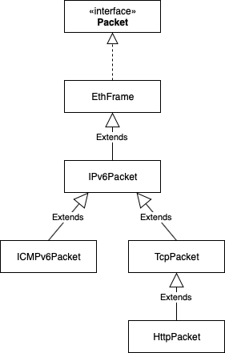

  

This project is implementation of TCP-IPv6 stack.  
The purpose is to make possible download website from machine with turned off default TCP-IPv6 stack.  
In order to turn linux stack off: **ip6tables -P INPUT DROP**  
In order to get website: **curl "http://[IPv6Addres%interface]/"**  
Project written using LIBPCAP  
